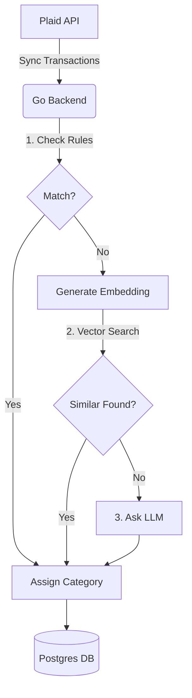

# Autonomous Transaction Categorization Agent

A full-stack application that autonomously categorizes financial transactions using a hybrid approach: deterministic rules, vector similarity search, and LLM reasoning.

## Features

- **Hybrid Categorization Engine**:
    1.  **Rules**: High-precision regex/string matching for recurring transactions.
    2.  **Vector Search**: Uses OpenAI embeddings and `pgvector` to find similar past transactions.
    3.  **LLM Fallback**: Uses OpenAI GPT to categorize novel transactions based on context.
- **Plaid Integration**: Seamlessly fetches transactions from bank accounts.
- **Modern Stack**:
    - **Backend**: Go (Golang) with `chi` router.
    - **Database**: PostgreSQL with `pgvector` extension.
    - **Frontend**: Next.js 14 (App Router) + TypeScript.
- **Dockerized**: Easy setup with Docker Compose.

## Architecture



## Getting Started

### Prerequisites

- Docker & Docker Compose
- Go 1.21+
- Node.js 18+

### Quick Start

1.  **Start the Database**
    ```bash
    docker-compose up -d
    ```

2.  **Configure Environment**
    Ensure `backend/.env` is set up with your keys:
    ```env
    DATABASE_URL=postgres://saumyapailwan@localhost:5432/txagent?sslmode=disable
    PLAID_CLIENT_ID=...
    PLAID_SECRET=...
    OPENAI_API_KEY=...
    ```

3.  **Run Backend**
    ```bash
    cd backend
    go mod tidy
    go run ./cmd/server/main.go
    ```

4.  **Run Frontend**
    ```bash
    cd frontend
    npm install
    npm run dev
    ```

Visit [http://localhost:3000](http://localhost:3000) to view transactions.

## Development

### Testing

To run the backend tests:

```bash
cd backend
go test ./...
```
